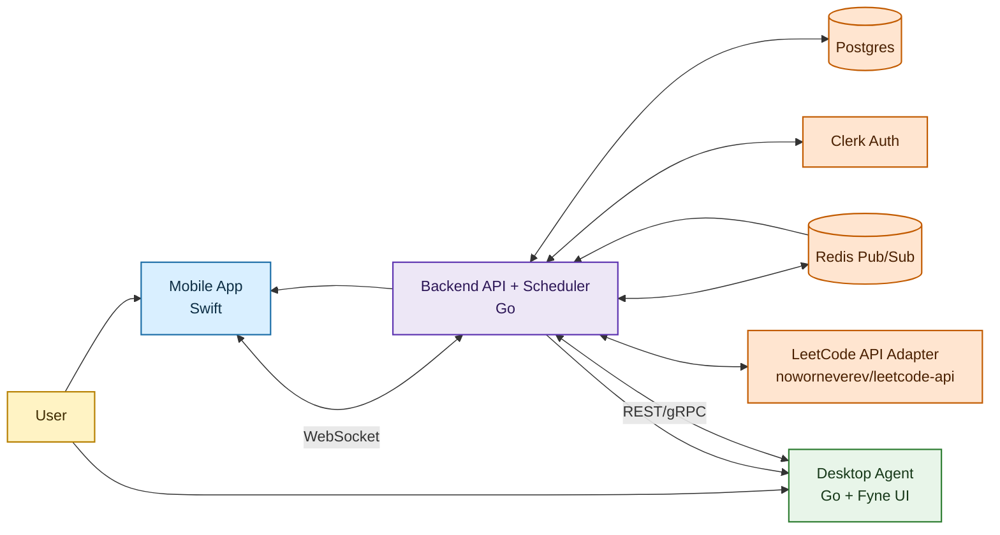
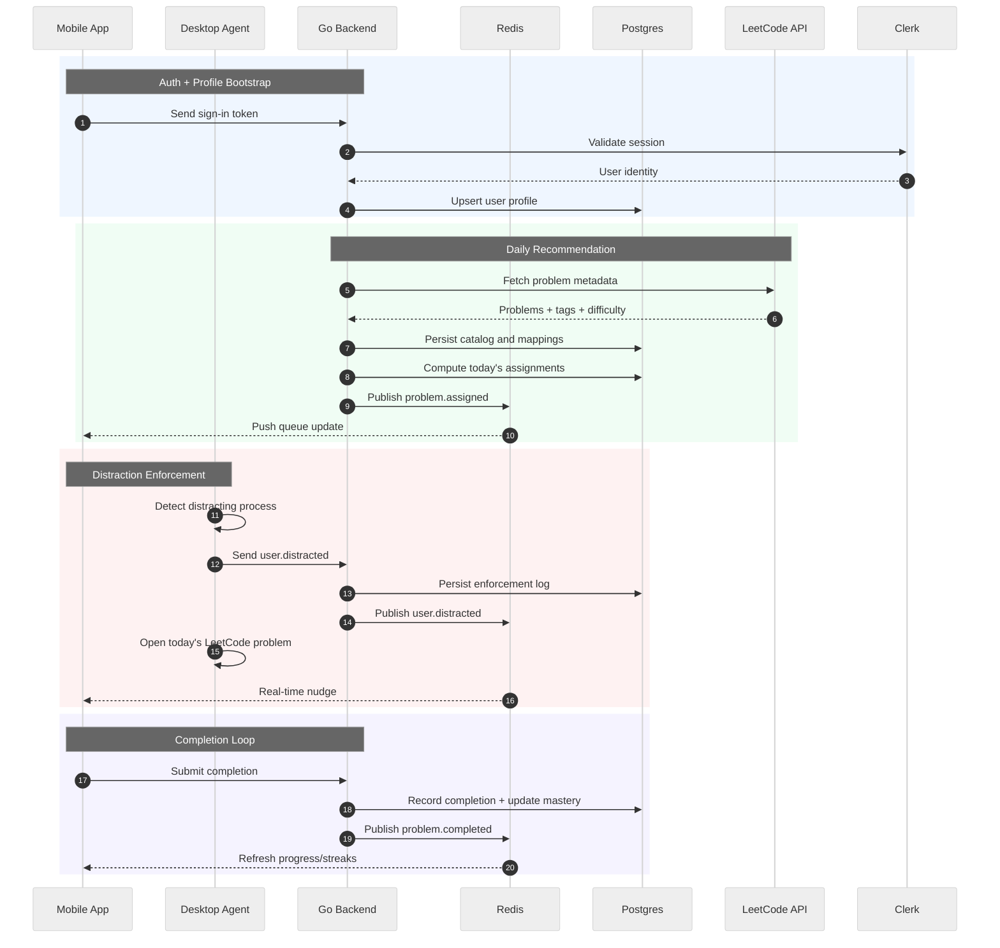
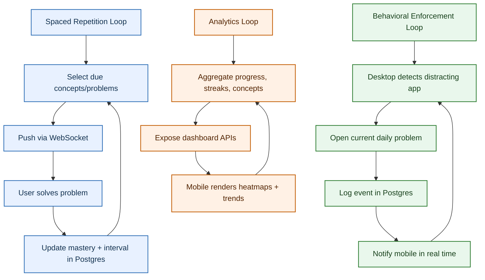
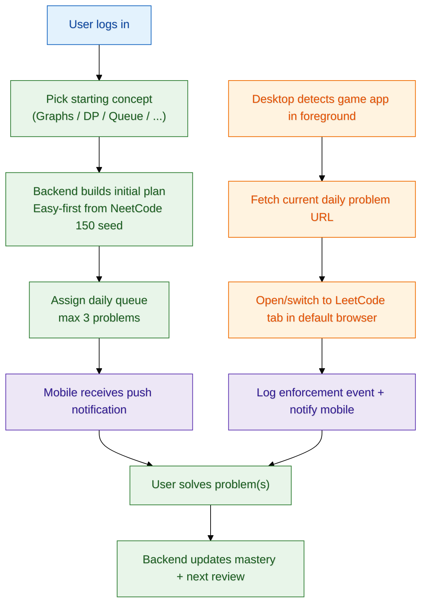

# Queue Up

Queue Up pairs spaced-repetition coaching with enforced focus, but the current MVP is centered on the desktop agent (mobile support remains on the roadmap).

## High-Level Purpose

- Mobile app delivers daily LeetCode problems using spaced repetition by concept cluster (DFS, DP, Graphs, Queue, etc.).
- Desktop app detects distracting game usage and forces a LeetCode tab to open in the default browser.
- Backend coordinates onboarding, scheduling, event delivery, auth, and analytics.

## Product Constraints (Current MVP)

- Desktop enforcement is the shipping experience: the Go-based agent opens a LeetCode tab whenever a configured game is detected, and the bundled Fyne UI lets you bootstrap via LeetCode credentials, pick concepts, and mark problems done.
- LeetCode metadata source: [noworneverev/leetcode-api](https://github.com/noworneverev/leetcode-api?tab=readme-ov-file) (queried by backend adapter).
- First login flow: user selects a starting concept cluster (example: Graphs, DP, Queue).
- Initial recommendation policy: prefer Easy problems first.
- Daily cap: assign up to `3` problems per day.
- Seed problem set: NeetCode 150 curated list as baseline; expand later to a broader internal set.
- Mobile app behavior: push notifications for daily queue + pending completions.
- Desktop behavior: when game usage is detected, open/switch to a new LeetCode tab in the system default browser, pointing to the current daily problem.

## Schema Snapshot

- `users` store the Clerk-linked identity, timezone, and creation timestamp that anchor every assignment.
- `concepts` captures both topical buckets (Arrays, Graphs) and technique-focused entries (DFS, Sliding Window, Prefix Sums, etc.), and the `type` enum keeps topics and techniques distinct.
- `user_concept_preferences` tracks each concept the user explicitly chose so the scheduler can bias today's queue toward those buckets.
- `problems` is the seeded catalog. Each row holds the `slug`, difficulty, canonical `url`, `source_set` tag (currently `NEETCODE_150` plus the handful of extra DSU/Queue/technique entries we added), `queue_rank`, and raw LeetCode `tags`. These fields make it easy to extend the catalog with specialized sets like prefix sums or segment trees before a broader LeetCode sync.
- `problem_concepts` links problems to one or more concepts or techniques, enabling cross-topic assignments.
- `daily_assignments` guarantees each user gets up to three problems per day, enforces unique (user, date, position), and records status (`ASSIGNED`, `COMPLETED`, `SKIPPED`) for the spaced repetition loop.
- The problem catalog already leans on the NeetCode 150 list plus our manual additions, but upcoming seeds will add more specialized problems (e.g., prefix sums, cumulative sums, and other focused techniques) and grow the database over time.

## Core Architecture



## End-to-End Data Flow



## Feedback Loops



## MVP User Flow



## Development Notes

- `submission-sanitizer-java/src/main/resources/application.properties` now ships in source control so the sanitizer service has an explicit default config instead of hiding it under ignore globs.
- `submission-sanitizer-java/target/` is ignored so Maven class artifacts stay out of git while the source config and code stay visible.
- The desktop agent keeps `config-example.json` versioned while each contributor can keep a local `desktop-agent/config.json` for machine-specific overrides.
- The Windows build script now runs `goversioninfo` (when installed) to bake the product metadata defined in `desktop-agent/cmd/queue-up-agent/versioninfo.json` into the executable; install it via `go install github.com/josephspurrier/goversioninfo/cmd/goversioninfo@latest` before running `desktop-agent/build-windows.ps1`.
- Infra side includes the `infra/aws/nginx` configs; we’ll drop a dedicated Nginx block once the SwiftUI client is in place.
- Swift UI mobile screens are coming next, so keep an eye on the `mobile/` branch layout once it gets merged.
- Problem catalog is already seeded with NeetCode 150 plus DSU/Queue extras and is being expanded with specialized topics (prefix sums, cumulative sums, etc.) so future assignments can drill into narrower skill slices.

## Remote backend endpoint

- The production API now lives at `https://queue-up-backend.duckdns.org`. Local desktop agents and any other clients should point their `backend_base_url`/API base to that domain instead of `localhost:8080` when you want to hit the deployed Postgres-backed dataset.
- Certbot-protected HTTPS is proxying to the Dockerized Go backend via the host-level Nginx proxy, so hitting `/health` or any `v1/...` endpoint on that hostname behaves the same as calling the local container ports.
- Rebuild or copy `desktop-agent/config.json` from `config.example.json` if you have a custom config; make sure `backend_base_url` uses the DuckDNS URL before starting the agent outside your Docker host.

## Docker Setup (Postgres + Backend)

### Prerequisites

- Docker Desktop running
- Bash shell (Git Bash/WSL/macOS/Linux)

### Start services

```bash
./docker-up.sh
```

This builds and runs:

- `queue-up-postgres` on `localhost:5432`
- `queue-up-go-backend` on `localhost:8080`

### Stop services (and clear DB volume)

```bash
./docker-down.sh
```

### Quick health check

```bash
curl http://localhost:8080/health
```

### API test flow

1. Generate today's recommendations:

```bash
curl "http://localhost:8080/v1/recommendation/today?user_id=00000000-0000-0000-0000-000000000001"
```

2. Mark problem complete from desktop source:

```bash
curl -X POST "http://localhost:8080/v1/completions" \
  -H "Content-Type: application/json" \
  -d "{\"user_id\":\"00000000-0000-0000-0000-000000000001\",\"problem_id\":1,\"source\":\"desktop\",\"verification\":\"manual\"}"
```

3. Query daily queue with checkbox state:

```bash
curl "http://localhost:8080/v1/daily-queue?user_id=00000000-0000-0000-0000-000000000001"
```
