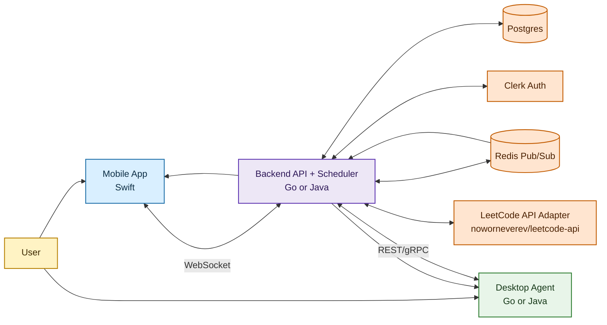
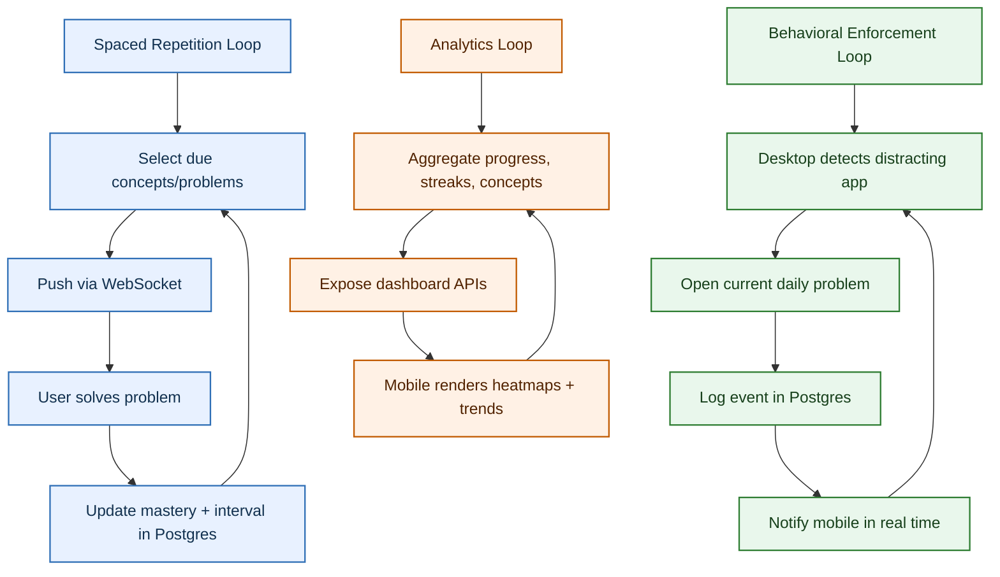
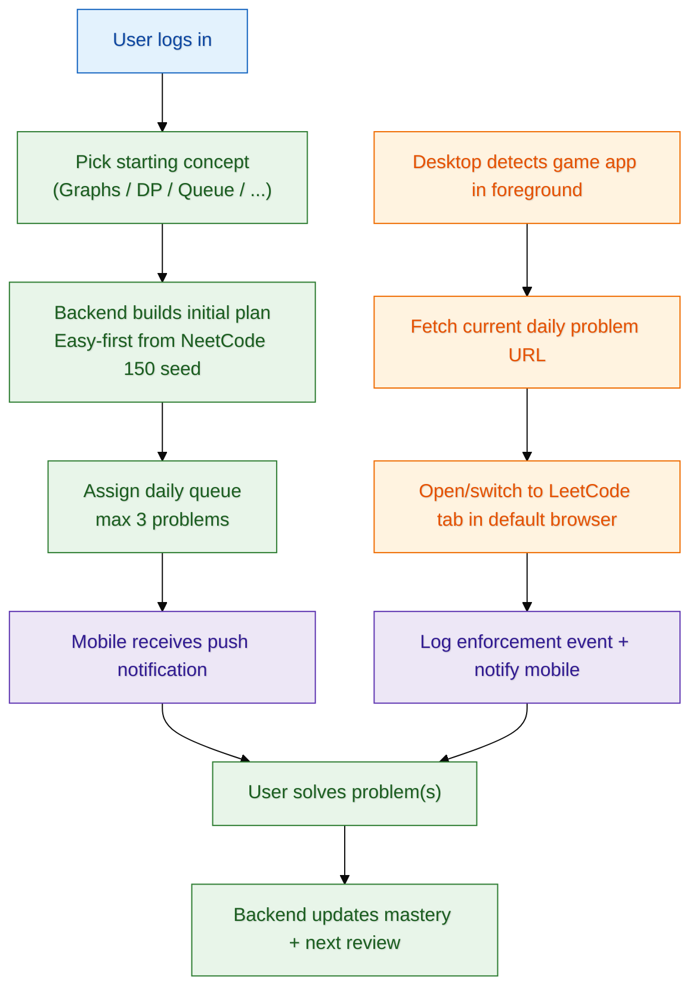

# Queue Up

Queue Up is a two-pronged system to improve LeetCode learning retention and enforce productive behavior across mobile and desktop.

## High-Level Purpose

- Mobile app delivers daily LeetCode problems using spaced repetition by concept cluster (DFS, DP, Graphs, Queue, etc.).
- Desktop app detects distracting game usage and forces a LeetCode tab to open in the default browser.
- Backend coordinates onboarding, scheduling, event delivery, auth, and analytics.

## Product Constraints (Current MVP)

- LeetCode metadata source: [noworneverev/leetcode-api](https://github.com/noworneverev/leetcode-api?tab=readme-ov-file) (queried by backend adapter).
- First login flow: user selects a starting concept cluster (example: Graphs, DP, Queue).
- Initial recommendation policy: prefer Easy problems first.
- Daily cap: assign up to `3` problems per day.
- Seed problem set: NeetCode 150 curated list as baseline; expand later to a broader internal set.
- Mobile app behavior: push notifications for daily queue + pending completions.
- Desktop behavior: when game usage is detected, open/switch to a new LeetCode tab in the system default browser, pointing to the current daily problem.

## Core Architecture

## End-to-End Data Flow

## Feedback Loops

## MVP User Flow

