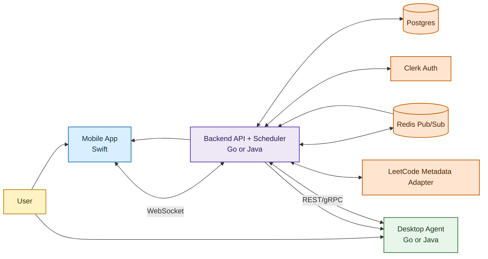
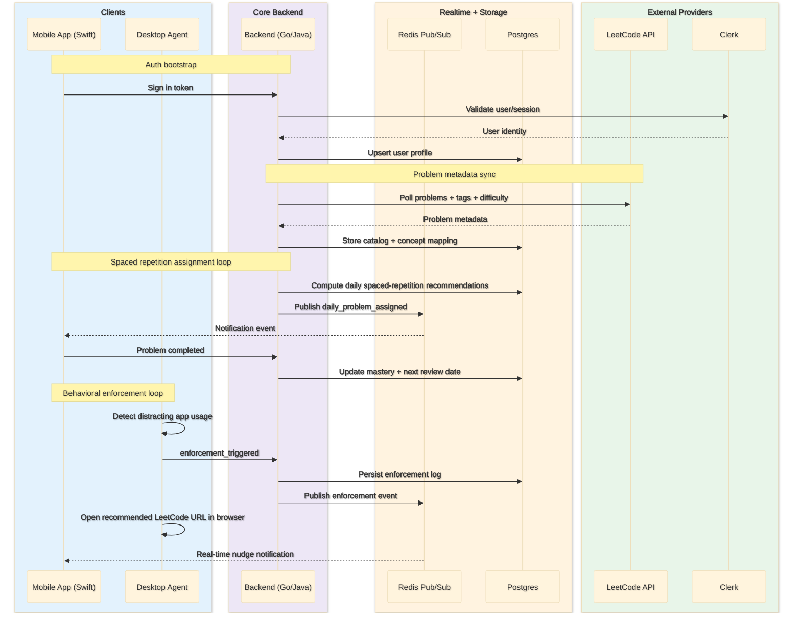
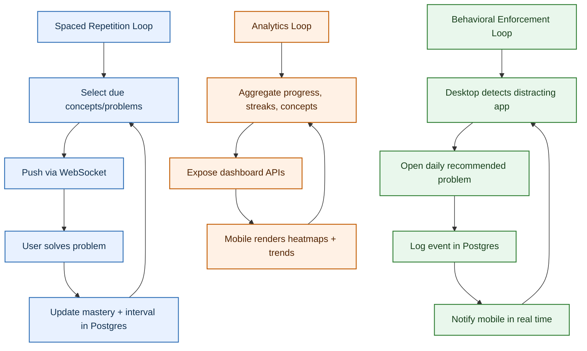

# Queue Up

Queue Up is a two-pronged system to improve LeetCode learning retention and enforce productive behavior across mobile and desktop.

## High-Level Purpose

- Mobile app delivers daily LeetCode problems using spaced repetition by concept cluster (DFS, DP, Graphs, etc.).
- Desktop app detects distracting app usage and forces the daily recommended LeetCode problem to open.
- Backend coordinates scheduling, event delivery, auth, and analytics.

## Core Architecture

## End-to-End Data Flow

## Feedback Loops

